<div align="center">

# Fadetouched

### A dark teal-green, earthy color theme.

`#11201e` base · 12-step neutral ramp · 12 muted, pigment-like accents · full syntax + terminal map

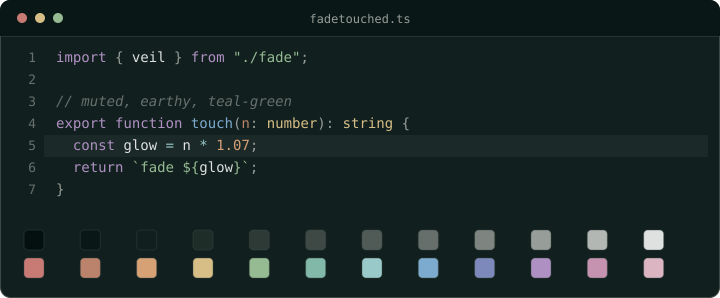

</div>

---

## About

Fadetouched is a dark green theme inspired by design systems like Catppuccin, Rosé Pine, and Tokyo Night, made so one palette can be applied across any and all apps, websites, and terminals. The name is a callback to Dragon Age, a game series close to my heart!

## Palette

### Fadetouched neutrals

<!-- AUTOGEN:neutrals:start -->
| | Token | Hex | Role |
|---|---|---|---|
|  | `n0` | `#03100f` | Deepest well / shadows |
|  | `n1` | `#091816` | Sidebars, secondary panes |
| 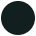 | `n2` | `#11201e` | **Background** (base) |
| 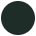 | `n3` | `#1f2d29` | Cards, inputs, status bar |
|  | `n4` | `#2e3a36` | Hover / active rows |
|  | `n5` | `#3e4945` | Borders, dividers |
|  | `n6` | `#505a56` | Strong borders, focus |
|  | `n7` | `#666f6b` | Comments, line numbers |
|  | `n8` | `#7e8580` | Doc comments |
| 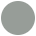 | `n9` | `#979d98` | Labels, subtle text |
|  | `n10` | `#b3b7b4` | Secondary text |
|  | `n11` | `#dee1df` | Primary text |
<!-- AUTOGEN:neutrals:end -->

### Fadetouched accents

<!-- AUTOGEN:accents:start -->
| | Token | Hex | Role |
|---|---|---|---|
| 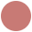 | `red` | `#c87a75` | Errors, deletions, builtins |
| 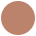 | `rust` | `#bc836c` | Parameters |
| 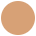 | `orange` | `#d7a176` | Numbers, constants |
| 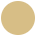 | `yellow` | `#d7be86` | Types, classes, warnings |
| 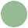 | `green` | `#96bb93` | Strings, success, additions |
| 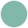 | `teal` | `#81b8a8` | Tags, info |
|  | `cyan` | `#99c9c9` | Operators, hints |
|  | `blue` | `#7daacf` | Functions, links, properties |
| 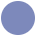 | `indigo` | `#7d89bb` | Decorators, active line |
| 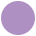 | `purple` | `#af90c3` | Keywords |
| 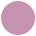 | `magenta` | `#c593af` | Escape / regex |
|  | `pink` | `#dbb5c1` | Cursor, modified |
<!-- AUTOGEN:accents:end -->

## Window materials

Fadetouched is also built for translucent shells: the Zed port ships a
**Fadetouched Blur** variant for `background.appearance: blurred` (needs OS window
blur; reliable on macOS, partial on Linux/Windows). Opaque is the safe default
everywhere.

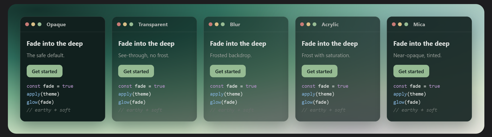

Each material shown over a mock desktop: opaque, transparent, blur, acrylic, and mica.

## Ports

Each port below is verified and has install steps. More are generated from the same palette but not yet verified; those are listed under [In testing](#in-testing). Please report anything that looks off.

### Zed
```sh
mkdir -p ~/.config/zed/themes
cp ports/zed/fadetouched.json ~/.config/zed/themes/
```
Then open the command palette → **theme selector** → **Fadetouched**. The file
also ships **Fadetouched Blur**, a translucent variant for Zed's blurred-window
background (needs OS window blur; reliable on macOS, partial on Linux/Windows).

### Windows Terminal
Copy the scheme from [`ports/windows-terminal/fadetouched.json`](ports/windows-terminal/fadetouched.json) into the `"schemes"` array in your `settings.json`, then set `"colorScheme": "Fadetouched"` on a profile.

### Firefox
Install from [Firefox Add-ons](https://addons.mozilla.org/en-US/firefox/addon/fadetouched-theme/).
Browser chrome only: it colors the toolbar, tabs, and menus, not web pages. (To
build the add-on locally, run `npm run pack:firefox`; source is in
[`ports/firefox/`](ports/firefox/).)

### KDE Plasma
```sh
cp ports/kde-plasma/Fadetouched.colors ~/.local/share/color-schemes/
```
Then pick **Fadetouched** in **System Settings → Colors & Themes → Colors**. To
drive the system accent from the theme's green, set **Accent color → From current
color scheme** on that same page. This is a color scheme only, not a full Plasma
desktop theme: it recolors apps and the shell but leaves icons, window
decorations, and the Plasma style as you have them.

### Konsole
```sh
cp ports/konsole/Fadetouched.colorscheme ~/.local/share/konsole/
```
Then pick **Fadetouched** in **Settings → Edit Current Profile → Appearance**.

For the matching cursor color, also copy the companion profile and switch to it:
```sh
cp ports/konsole/Fadetouched.profile ~/.local/share/konsole/
```
Then choose the **Fadetouched** profile in **Settings → Manage Profiles**. The
profile only sets the colors and cursor; it falls back to Konsole's defaults for
anything it leaves out (font included), so re-pick your font on it if needed.
Konsole has no custom selection color: it derives the selection highlight from
the scheme automatically.

### WezTerm
```sh
mkdir -p ~/.config/wezterm/colors
cp ports/wezterm/fadetouched.toml ~/.config/wezterm/colors/
```
Then set `color_scheme = "Fadetouched"` in your `wezterm.lua`. WezTerm picks up
TOML schemes from that colors directory automatically.

### Starship
A two-line powerline prompt. Copy the config to Starship's default path:
```sh
cp ports/starship/fadetouched.toml ~/.config/starship.toml
```
Needs a [Nerd Font](https://www.nerdfonts.com/) for the powerline separators and
language icons. To keep it as a separate file instead of your main config, point
the `STARSHIP_CONFIG` environment variable at it instead.

### PowerShell
Colors the command line (PSReadLine syntax highlighting) as you type. Dot-source
[`ports/powershell/fadetouched.ps1`](ports/powershell/fadetouched.ps1) from your
`$PROFILE`:
```powershell
. "path\to\fadetouched.ps1"
```
Open a new session (or run `. $PROFILE`) to apply. Uses PSReadLine (bundled with
PowerShell 5.1+ and 7+). It only colors typed input, so it sits alongside a prompt
like Starship.

### Codex
The Codex Desktop App theme ships as an importable theme string plus a readable
JSON companion for review. Open Codex, go to **Settings → Appearance → Import**,
then paste the contents of
[`ports/codex/fadetouched.codex-theme`](ports/codex/fadetouched.codex-theme).
It maps Codex's accent, surface, ink, diff, and skill colors directly to
Fadetouched palette tokens.

### OpenCode
A dark terminal UI theme for OpenCode. Copy the generated theme into OpenCode's
user theme directory:
```sh
mkdir -p ~/.config/opencode/themes
cp ports/opencode/fadetouched.json ~/.config/opencode/themes/
```
Restart OpenCode, then select `fadetouched` with `/theme`, or set
`"theme": "fadetouched"` in `~/.config/opencode/tui.json`. Needs a truecolor
terminal. Tested with OpenCode 1.17.18 on Windows.

### Notepad++
Copy [`ports/notepad-plus-plus/Fadetouched.xml`](ports/notepad-plus-plus/Fadetouched.xml)
to `%AppData%\Notepad++\themes\`, restart Notepad++, then pick **Fadetouched** in
**Settings → Style Configurator**. Covers the editor UI and ~20 common languages;
other languages use the default text color.

### Trilium
For the modern **Next** theme. Create a CSS code note, paste
[`ports/trilium/fadetouched.css`](ports/trilium/fadetouched.css) into it, and add
**two** owned attributes: `#appTheme=Fadetouched` and `#appThemeBase=next-dark`.
Then pick **Fadetouched** under **Settings → Appearance → Theme** and reload with
**Ctrl+Shift+R**. The `#appThemeBase=next-dark` attribute is required: without it
only the background recolors. (TriliumNext's theme variables are beta and renamed
often, so a future update may need a refresh.)

### Obsidian
Copy the [`ports/obsidian/`](ports/obsidian/) folder into your vault as
`<vault>/.obsidian/themes/Fadetouched/` (it ships `theme.css` + `manifest.json`;
the folder name must match the theme name). Then enable **Fadetouched** under
**Settings → Appearance → Themes**. Dark-only: in Obsidian's light mode it falls
back to Obsidian's default palette. Note that code blocks only show syntax colors
when the opening code fence names a language (for example `js` or `css`).

### Calibre
A dark palette for the calibre e-book manager's interface. In **Preferences →
Interface → Look & feel → Adjust colors**, click **Import**, pick
[`ports/calibre/Fadetouched.calibre-palette`](ports/calibre/Fadetouched.calibre-palette),
set the mode dropdown to **Dark** (or **System** if your OS is dark), and click
**OK**. Needs calibre 6.0+ (tested on 9.9). It themes dark mode only; in light
mode calibre keeps its default palette.

### ShareX
A dark application theme for ShareX. In **Application Settings → Theme → Import →
From File**, pick [`ports/sharex/fadetouched.json`](ports/sharex/fadetouched.json),
then select **Fadetouched** from the theme list. Close and reopen Application
Settings after selecting it so ShareX repaints every settings page.

### Feishin
A dark theme for the [Feishin](https://github.com/jeffvli/feishin) music player. In
**Settings → Advanced → Custom CSS**, enable it, click **Edit**, paste
[`ports/feishin/fadetouched.css`](ports/feishin/fadetouched.css), and **Save**.
Select a dark base theme (e.g. Default Dark) first; the theme only overrides colors
and relies on the base theme for dark mode. As with Feishin's own themes, a few
Mantine controls keep their default shade.

### AO3 (Archive of Our Own)
A dark site skin for the fanfiction archive. On AO3, go to your dashboard →
**Skins → Create Site Skin**, paste the CSS from
[`ports/ao3/fadetouched.css`](ports/ao3/fadetouched.css) into the CSS field, and
create it. Then click **Use** on the skin (or set it as your default under
**Preferences**). Site skins apply only while you're logged in; re-paste the CSS
after any update.

### Startpage
A dark userstyle for the [startpage.com](https://www.startpage.com) search
engine. Install the [Stylus](https://add0n.com/stylus.html) browser extension,
create a new style, paste the CSS from
[`ports/startpage/fadetouched.css`](ports/startpage/fadetouched.css), and save.
It is scoped to `startpage.com` via `@-moz-document`. Modeled on the Catppuccin
userstyle; like any site userstyle it can break when the site is redesigned, so
report anything that looks off.

### Cursor
A dark cursor set based on Bibata Modern, with a custom green "veilfire" ring
spinner for the busy and progress cursors. Prebuilt Windows and Linux (XCursor)
packs and install steps are in [`ports/cursor/`](ports/cursor/). This is the one
GPL-3.0 part of the project (it derives from Bibata); see License below.

### Zellij
A component-based theme for the [Zellij](https://zellij.dev) terminal workspace,
covering the status bar, tabs, panes/frames, tables, lists, and the multiplayer
cursor colors. Copy it into Zellij's themes directory:
```sh
mkdir -p ~/.config/zellij/themes
cp ports/zellij/fadetouched.kdl ~/.config/zellij/themes/
```
Then set `theme "fadetouched"` in `~/.config/zellij/config.kdl` and open a new
session. The active tab fills with the accent green; focused pane frames use the
accent, unfocused a neutral border.

### In testing
Generated from the same palette and usable, but not yet verified. Some have
install notes below; expect rough edges and please report anything off:
[`alacritty`](ports/alacritty/), [`base16`](ports/base16/), [`fish`](ports/fish/),
[`foot`](ports/foot/), [`ghostty`](ports/ghostty/), [`helix`](ports/helix/),
[`iterm`](ports/iterm/), [`kitty`](ports/kitty/), [`limine`](ports/limine/),
[`mintty`](ports/mintty/), [`neovim`](ports/neovim/), [`nushell`](ports/nushell/),
[`termux`](ports/termux/), [`tmux`](ports/tmux/), [`vscode`](ports/vscode/),
[`web`](ports/web/), [`zsh`](ports/zsh/).

The [`qbittorrent`](ports/qbittorrent/) port ships the theme sources
(`config.json` + `stylesheet.qss`); package them into a `.qbtheme` with Qt's
`rcc` (`rcc -binary -o fadetouched.qbtheme resources.qrc`, Qt6 for qBittorrent
4.6.0+), then select it under **Tools → Options → Behavior → Use custom UI
theme** and restart.

The fish and Nushell shell ports color command-line syntax highlighting.
**fish**: copy [`ports/fish/Fadetouched.theme`](ports/fish/Fadetouched.theme) to
`~/.config/fish/themes/`, then run `fish_config theme choose Fadetouched` followed
by `fish_config theme save`. **Nushell**: `source` the
[`ports/nushell/fadetouched.nu`](ports/nushell/fadetouched.nu) file from your
`config.nu` (or paste its contents in before `let config`).

The tmux, Foot, and Mintty ports are plain color snippets. **tmux**: `source-file`
[`ports/tmux/fadetouched.tmux`](ports/tmux/fadetouched.tmux) from `~/.tmux.conf`.
**Foot**: copy the `[colors]` block from
[`ports/foot/fadetouched.ini`](ports/foot/fadetouched.ini) into `foot.ini`.
**Mintty**: copy [`ports/mintty/fadetouched.minttyrc`](ports/mintty/fadetouched.minttyrc)
to a Mintty `themes` resource folder, then select it from the Looks theme picker
or set it with `ThemeFile`.

## License

[MIT](LICENSE). © Arishawke.

Exception: [`ports/cursor/`](ports/cursor/) is **GPL-3.0**, because it derives
from [Bibata](https://github.com/ful1e5/Bibata_Cursor). It carries its own
[`LICENSE`](ports/cursor/LICENSE) and
[`ATTRIBUTION.md`](ports/cursor/ATTRIBUTION.md). Everything else is MIT.
