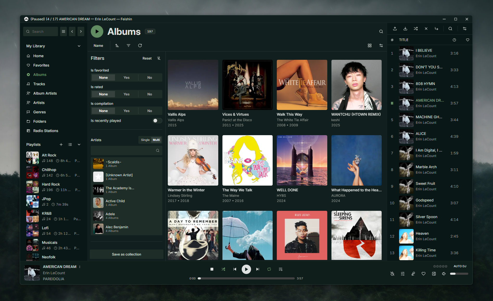

# Fadetouched for Feishin

## Install

1. In Feishin, select a dark base theme.
2. Open **Settings > Advanced > Custom CSS** and enable it.
3. Click **Edit**, paste the contents of
   [`fadetouched.css`](fadetouched.css), and save.
