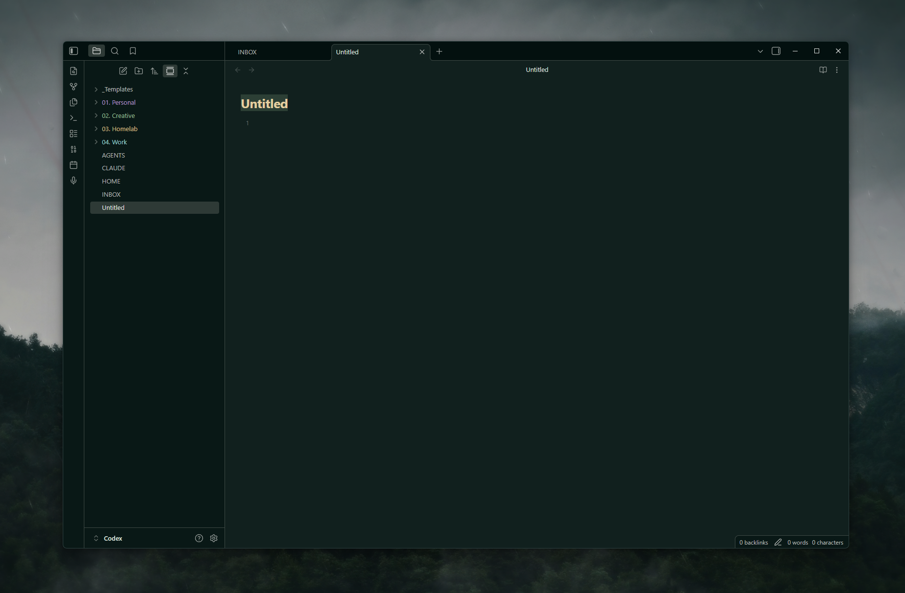

# Fadetouched for Obsidian

## Install

1. Create `<vault>/.obsidian/themes/Fadetouched/`.
2. Copy [`theme.css`](theme.css) and [`manifest.json`](manifest.json) into it.
3. In Obsidian, open **Settings > Appearance > Themes** and select
   **Fadetouched**.

Fadetouched is made for Obsidian's dark appearance.
