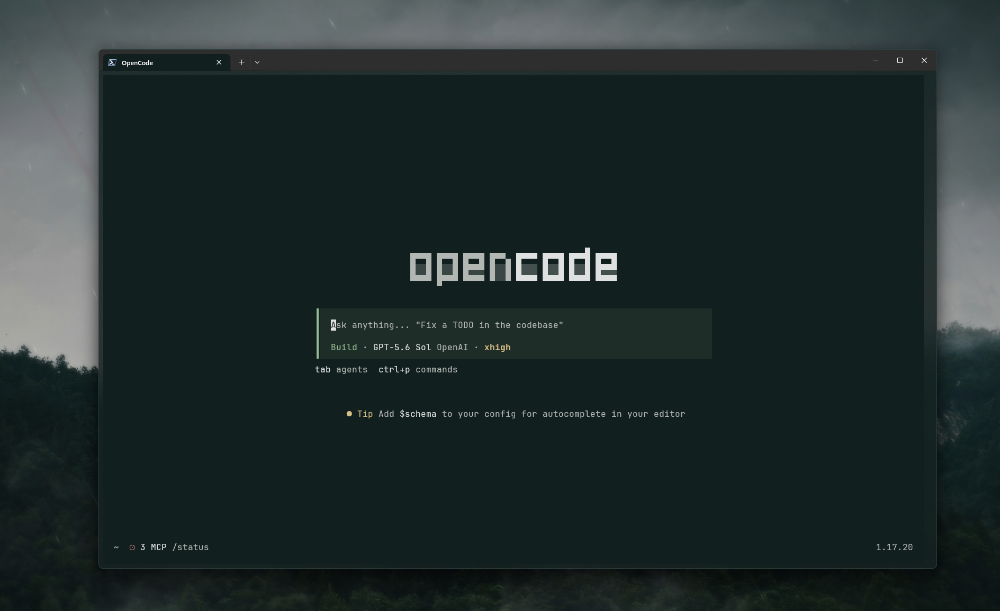

# Fadetouched for OpenCode

## Install

1. Copy [`fadetouched.json`](fadetouched.json) to
   `~/.config/opencode/themes/fadetouched.json`.
2. Restart OpenCode.
3. Run `/theme` and select **fadetouched**.

A terminal with true color support is recommended.
