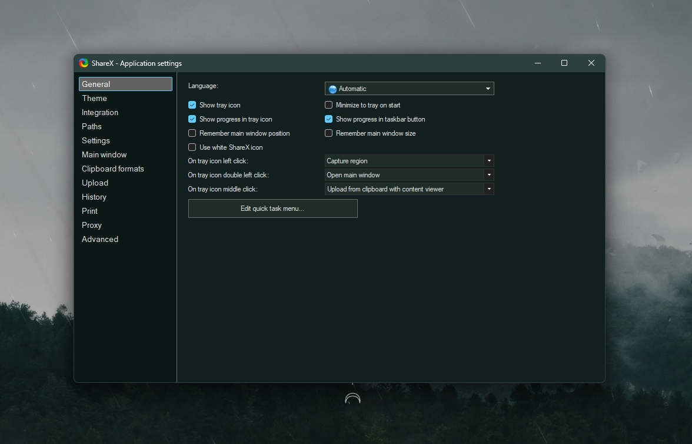

# Fadetouched for ShareX

## Install

1. Open **Application Settings > Theme > Import > From File**.
2. Choose [`fadetouched.json`](fadetouched.json).
3. Select **Fadetouched** from the theme list.

Close and reopen Application Settings if a page does not repaint immediately.
