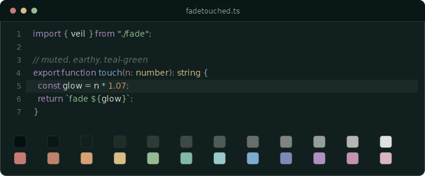

# Fadetouched for Yazi



## Install

1. Copy this `fadetouched.yazi` folder into Yazi's `flavors` folder.

Windows: `%AppData%\yazi\config\flavors\`

macOS and Linux: `~/.config/yazi/flavors/`

2. Add this to `theme.toml`:

```toml
[flavor]
dark = "fadetouched"
```

3. Restart Yazi.

This flavor targets Yazi 26.5.6. Yazi's flavor format is currently in beta.
