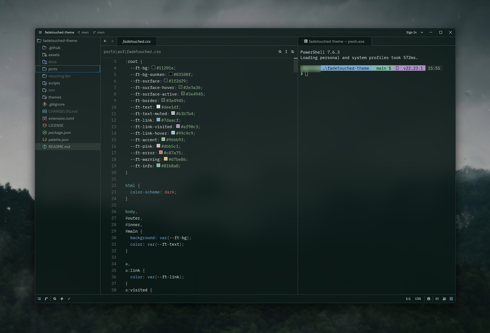

# Fadetouched for Zed

## Install

| System | Themes folder |
|---|---|
| Windows | `%USERPROFILE%\AppData\Roaming\Zed\themes\` |
| macOS and Linux | `~/.config/zed/themes/` |

1. Copy [`fadetouched.json`](fadetouched.json) to the themes folder.
2. Reload Zed.
3. Open the command palette and choose **Theme Selector: Toggle**.
4. Select **Fadetouched**.

**Fadetouched Blur** is included for systems where Zed's blurred window
background is available. The standard **Fadetouched** variant works everywhere.
